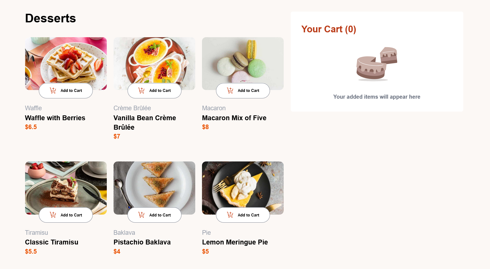
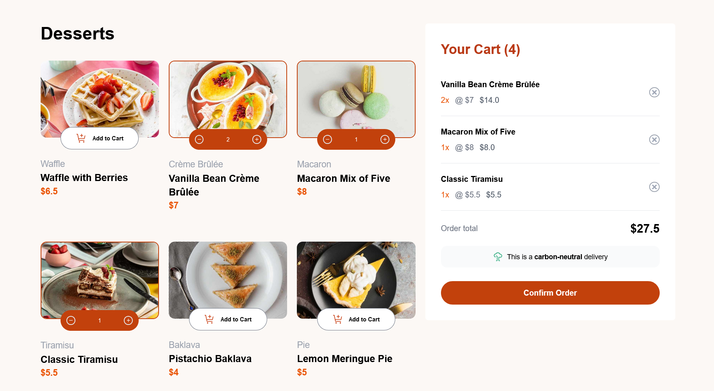
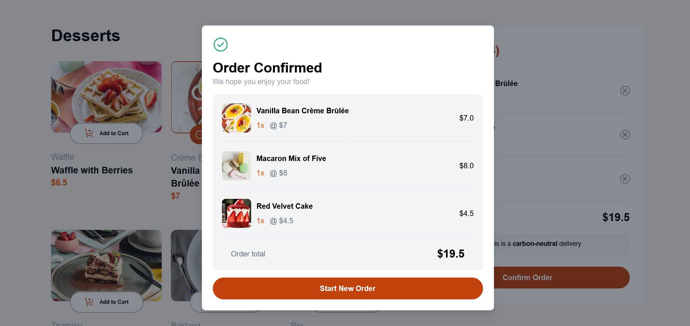
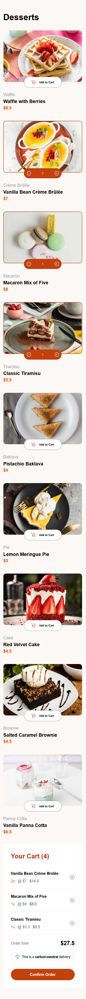
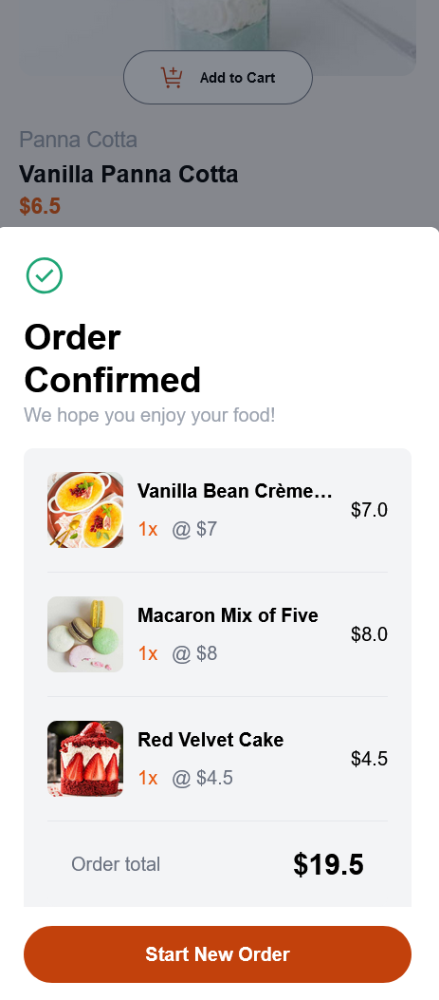

# Frontend Mentor - Product list with cart solution

This is a solution to the [Product list with cart challenge on Frontend Mentor](https://www.frontendmentor.io/challenges/product-list-with-cart-5MmqLVAp_d). Frontend Mentor challenges help you improve your coding skills by building realistic projects. 

## Table of contents

- [Overview](#overview)
  - [The challenge](#the-challenge)
  - [Screenshot](#screenshot)
  - [Links](#links)
- [My process](#my-process)
  - [Built with](#built-with)
  - [What I learned](#what-i-learned)
  - [Continued development](#continued-development)
  - [Useful resources](#useful-resources)
- [Author](#author)

## Overview

### The challenge

Users should be able to:

- Add items to the cart and remove them
- Increase/decrease the number of items in the cart
- See an order confirmation modal when they click "Confirm Order"
- Reset their selections when they click "Start New Order"
- View the optimal layout for the interface depending on their device's screen size
- See hover and focus states for all interactive elements on the page

### Screenshot








### Links

- Solution URL: [GitHub Source Code](https://github.com/Khunse/product-list-with-card)
- Live Site URL: [Product-List-With-Card](https://khunse.github.io/product-list-with-card/)

## My process

### Built with

- HTML markup
- CSS custom properties
- Flexbox
- Tailwindcss
- Mobile-first workflow
- [React](https://reactjs.org/) - JS library


### What I learned


```html
<h1>I'm proud of myself as I've finished this challenge eventhough I has a lot of improvements. During this challenge, I learned more about how to build website with react and how to host static site.</h1>
```

### Continued development

What I want to improve this project about is that I want to make it more responsive and suitable for different devices screen.

### Useful resources

- [ CSS Styling ](https://www.youtube.com/@KevinPowell) - This helped me for styling and make the website responsive and learned alot about CSS. I really liked this channel and will use it going forward whenever I came across the CSS things which I don't understand.


## Author

- Frontend Mentor - [@Khunse](https://www.frontendmentor.io/profile/Khunse)

